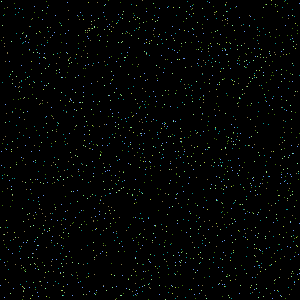

# ImTron
 ImTron is a tool to generate Transistion Images connecting 2 or more Images and generating GIFs or Videos from few images
 
## Combined Transistions
   - Generates transistion images based on combination of all factors
   - Can be exported as GIF or Video
   
   
   
   
   
## Location Based Transistions
   - Generates transistion images based on location mapping between input image pixels
   - Can be exported as GIF or Video
   
   
   
   
   
## Colour Based Transistions
   - Generates transistion images based on colour of corresponding pixels in input images
   - Can be exported as GIF or Video
   
   
   
   
   
## Other Transistions
   - Various Other Transistions
   - Can be exported as GIF or Video
   
   Single Pixel Explode Transistion
   
   
   
